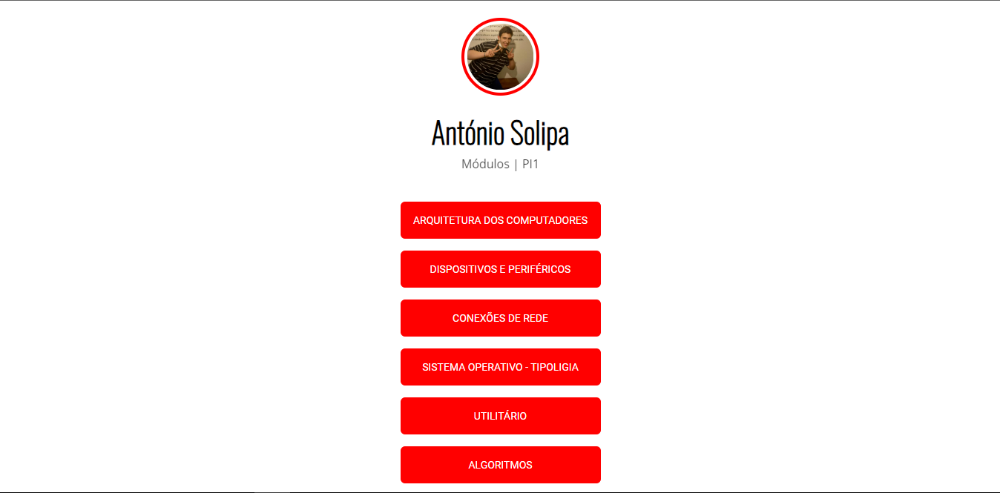

# Página de links dos Módulos PI1 - António Solipa

 

## 💻 Sobre

Página de links, na propósta de ser usada para cosulta de modulos, feita para dilvulgar os modulos realizados pelo aluno <a href="https://github.com/asolipa0">António Solipa</a>, atraves do conteudo apredido na Escola Profisional do Fundão.

---

<table>
  <tr>
    <td>
      
    </td>
    <td>
      Feito por <a href="https://github.com/asolipa0">António Solipa. 🙋‍♂️</a>
    </td>
  </tr>
</table>
